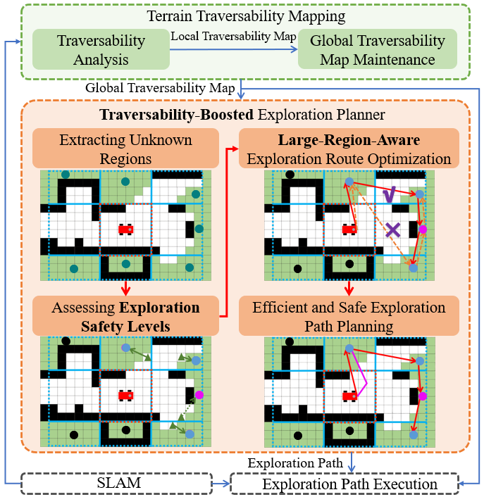
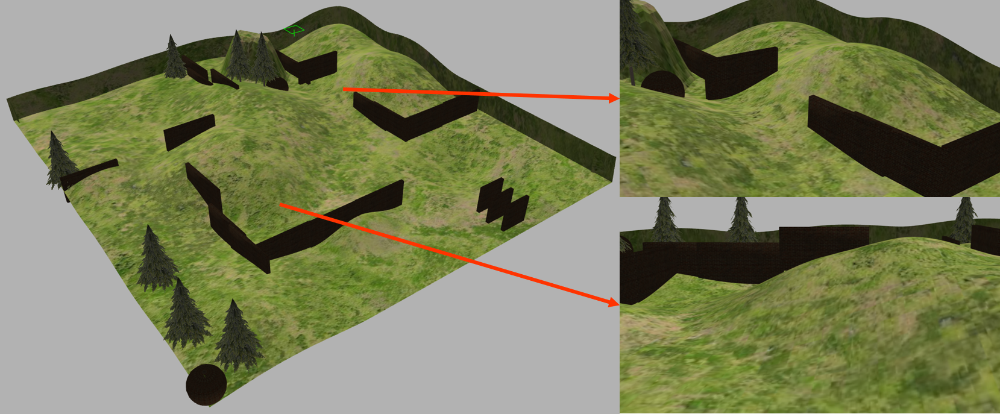
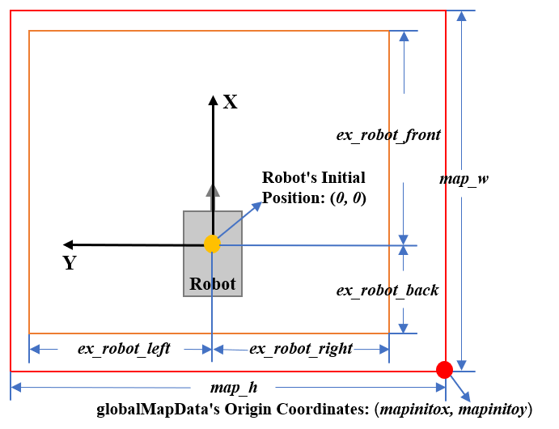

# LRAE

**LRAE** is a **L**arge-**R**egion-**A**ware **E**xploration method that enables a ground robot to autonomously explore uneven terrains.

To obtain high exploration efficiency, LRAE adopts a large-region-aware exploration route optimization strategy that prioritizes exploring large regions while also considering exploring nearby small regions. To safely and completely explore uneven terrains, LRAE fully introduces traversability information to extract unknown regions and assess exploration safety levels. The safety levels are then integrated into the design of the exploration strategy to ensure safe robotic exploration. We validate LRAE in various challenging simulation scenes and real-world wild uneven terrains. The results show that our method can safely explore uneven terrains and improve exploration efficiency by up to 45.3% compared with state-of-the-art methods.

<p align="center">
 
 
</p>


**Video Link**: [Video on Youtube](https://youtu.be/xePDPZluLes); [Video on Bilibili](https://www.bilibili.com/video/BV1g1SVYWEfw/?spm_id_from=333.999.0.0&vd_source=0e7c59dd804a18d9a9c201eafe9ac6e5)

**Related Paper**: [Paper on IEEE](https://ieeexplore.ieee.org/document/10734213)

Q. Bi, X. Zhang, S. Zhang, R. Wang, L. Li and J. Yuan, "LRAE: Large-Region-Aware Safe and Fast Autonomous Exploration of Ground Robots for Uneven Terrains," in IEEE Robotics and Automation Letters, vol. 9, no. 12, pp. 11186-11193.

(If it is useful to you, please cite our paper and ⭐️ our code.)

**Other Links**: [multi-robot exploration code CURE1](https://github.com/NKU-MobFly-Robotics/CURE1)

## Prerequisites

1. LRAE has been tested on __Ubuntu 20.04 with ROS Noetic__, please run the following commands to install required dependencies or tools:
```bash
sudo apt-get install ros-noetic-gazebo-* \
ros-noetic-gazebo-ros-control* \
ros-noetic-controller-* \
ros-noetic-ros-controllers \
ros-noetic-ros-control \
ros-noetic-tf2-* \
ros-noetic-velodyne-* \
ros-noetic-robot-state-publisher* \
ros-noetic-joint-state-controller* \
ros-noetic-velocity-controllers* 
```

2. In addition, we recommend that you download [gazebo_models](https://github.com/osrf/gazebo_models) and [Supplementary Gazebo Models for LRAE](https://github.com/qingchen-bi/Supplementary-Gazebo-Models-for-LRAE) to the directory `~/.gazebo/models`.

## Build LRAE
Then simply clone and compile our package:
```bash
cd ${YOUR_WORKSPACE_PATH}/src
git clone git@github.com:NKU-MobFly-Robotics/LRAE.git
cd ../ 
catkin_make
```

## Known issues

1. ```
   resource not found: velodyne_description
   ROS path [0]=/opt/ros/noetic/share/ros
   ROS path [1]=/${YOUR_WORKSPACE_PATH}/src
   ROS path [2]=/opt/ros/noetic/share
   ```

   ```bash
   sudo apt-get install ros-noetic-velodyne-*
   ```

2. ```
   E: Unable to locate package ros-noetic-velodyne-*
   E: Couldn't find any package by glob 'ros-noetic-velodyne-*'
   E: Couldn't find any package by regex 'ros-noetic-velodyne-*'
   ```

   ```bash
   sudo apt-get update
   ```
   
4. ```
   [INFO] [1724678398.723761, 1733.140000]: Loading controller: scout_motor_rr_controller
   [ERROR] [1724678398.729870298, 1733.145000000]: Could not load controller 'scout_motor_rr_controller' because controller type 'velocity_controllers/JointVelocityController' does not exist.
   [ERROR] [1724678398.729950407, 1733.146000000]: Use 'rosservice call controller_manager/list_controller_types' to get the available types
   [ERROR] [1724678399.731316, 1733.943000]: Failed to load scout_motor_rr_controller
   ```

   ```bash
   sudo apt-get install ros-noetic-ros-controllers ros-noetic-ros-control
   ```
5. **Some common issues can also be referred to on the "Issues" page.**

## Run LRAE in simulation

After the compilation is successful, you need to open two terminals and run the following two commands.

``` bash
source devel/setup.bash && roslaunch fitplane simulation_scene1.launch
```

``` bash
source devel/setup.bash && roslaunch lrae_planner exploration_scene1.launch
```

After running the above two commands, if you can see the **red route path**, the **purple exploration path**, the **green local path**, and the robot has begun moving to explore in the RVIZ interface, it means that LRAE has started successfully.

## Run LRAE in different scenes

We have designed four testing scenes with different characteristics and sizes：

<div style="display: flex; justify-content: center; gap: 10px;">
	<figure>
  		
   		<figcaption>Scene 1</figcaption>
    </figure>
    <figure>
  		
   		<figcaption>Scene 2</figcaption>
    </figure>
</div>

If you want to run LRAE in Scene 2, you need to modify the above two commands to：

```bash
source devel/setup.bash && roslaunch fitplane simulation_scene2.launch
```

```bash
source devel/setup.bash && roslaunch lrae_planner exploration_scene2.launch
```

For Scene 3 and Scene 4, the method is the same as above.

## Run LRAE in other scenes
Schematic diagram of some parameters:
<div style="display: flex; justify-content: center; gap: 10px;">
	<figure>
  		
    </figure>
</div>

We assume that exploration problems have boundaries, otherwise, exploration will continue indefinitely.
Therefore, you need first to define the exploration boundary for the robot according to the scene, then set the parameters of the `globalMapData` according to the exploration boundary to ensure that the range of the exploration boundary is within the range of the `globalMapData`.


**Please follow the following steps:**

Let the robot's initial position be the coordinate origin, the robot's orientation be the positive direction of the x-axis, and the y-axis follows the right-hand coordinate system, the range of the exploration boundary in this coordinate system should be within the range of `globalMapData` determined by the four parameters `map_w`, `map_h`, `mapinitox`, and `mapinitoy` in node “exploration_map_merge”:
1. Add the following parameters to node “Traversibility_mapping”：
```xml
​<param name="use_ex_range" value="true"/>
<param name="ex_robot_back" value="-10.0"/>
​<param name="ex_robot_right" value="-10.0"/>
​<param name="ex_robot_front" value="50.0"/>
​<param name="ex_robot_left" value="50.0"/>
```
2. Modify the following parameters of the `globalMapData` in node “exploration_map_merge”：
```xml
​<param name="map_w" type="int" value="200" />
​<param name="map_h" type="int" value="200" />
​<param name="mapinitox" type="double" value="-10.0" />
​<param name="mapinitoy" type="double" value="-10.0" />
```
3. The conditions that need to be met between parameters:
	1. ​If it is necessary to define the exploration boundary, `use_ex_range` is true; otherwise, it is false;
	2. ​`ex_robot_front` represents the farthest distance that can be explored along the positive x-axis；
	3. ​`ex_robot_back` represents the farthest distance that can be explored along the negative x-axis；
	4. ​`ex_robot_left` represents the farthest distance that can be explored along the positive y-axis;
	5. ​`ex_robot_right` represents the farthest distance that can be explored along the negative y-axis;
	6. ​`map_w` is greater than or equal to ((`ex_robot_front` + abs(`ex_robot_back`)) / map resolution) then **round up**         
	7. ​`map_h` is greater than or equal to ((`ex_robot_left` + abs(`ex_robot_right`)) / map resolution) then **round up**;
	8. ​note: map resolution has been set to 0.3 in this code repository；
	9. ​`mapinitox` is less than or equal to `ex_robot_back`;
	10. ​`mapinitoy` is less than or equal to `ex_robot_right`;
	11. ​In conclusion, the exploration boundary range defined by the “Traversibility_mapping” node must be entirely within the range of the `globalMapData` determined by the “exploration_map_merge” node.

## Main Parameters
Main parameters affecting terrain traversability analysis:
```C++
float max_angle_ = 40.0;
float max_flatness_ = 0.01;
float w1_ = 0.8;
```
Main parameters affecting exploration performance:
```xml
<param name="angle_pen" type="double" value ="0.45" />
<param name="update_cen_thre" type="int" value="6" />
<param name="unknown_num_thre" type="int" value ="200" />
<param name="minrange" type="double" value="20.0" />
<param name="limit_max_square" type="bool" value ="true" />
<param name="use_go_end_nearest" type="bool" value="true" />
<param name="end_neacen_disthre" type="double" value ="10.0" />
<param name="end_cur_disrate" type="double" value="2.0" />
```
If the robot ends up exploring some tiny unknown regions back and forth, please increase the `unknown_num_thre` parameter appropriately. 
Remark: Since the Real Time Factor in Gazebo is not always equal to 1, please use the ros::Time class to measure the exploration time instead of using the actual wall-clock time.

## Acknowledgements

We sincerely appreciate the following open source projects: [FAEL](https://github.com/SYSU-RoboticsLab/FAEL), [TARE](https://github.com/caochao39/tare_planner), [PUTN](https://github.com/jianzhuozhuTHU/putn), and Ji Zhang's [local_planner](https://github.com/jizhang-cmu/ground_based_autonomy_basic/tree/noetic/src/local_planner).
